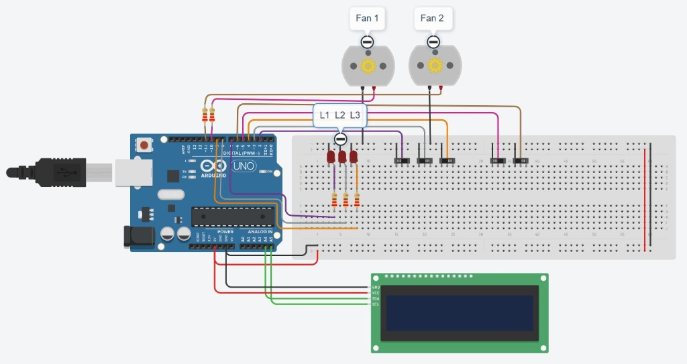

# ⚡ Hardware Control System & Circuit Schematic Mappings

This document details the hardware design, pinout lists, and electrical schematics for the **Smart Office Monitoring System** physical interface prototype.

---

## 🎨 Visual Hardware Circuit Schematic



---

## 🔗 Live Tinkercad Board Simulation
* **Interactive Tinkercad Design**: [Tinkercad Circuits Board Simulator Link](https://www.tinkercad.com/things/einAtGABmEy/editel?returnTo=%2Fdashboard&sharecode=9LEbM-ddvtuEevOx3uDI34FDEFHuSLfaDcYNqvMKAhw)

---

## 1. System Overview

To represent the hardware implementation, we simulate **one full room** containing:
* **3 Lights**: Represented by **3 Red LEDs** (anodes mapped to GPIO pins).
* **2 Fans**: Represented by **2 DC Motors** (representing fan output states).
* **5 Slide Switches**: Acting as manual local overrides to turn items ON/OFF physically.
* **1 I2C 16x2 LCD Display**: Outputs real-time power metrics and active device counts.
* **Controller**: Arduino Uno / ESP32 microcontroller.

---

## 2. Arduino Pinout Mapping

| Device Name | Device Type | Microcontroller Pin | Relay/Switch Channel | Indicator Component | Description |
| :--- | :--- | :--- | :---: | :--- | :--- |
| **Fan 1** | Fan | **Pin D9** | Pin D3 (Switch) | DC Motor 1 | Fan 1 output state |
| **Fan 2** | Fan | **Pin D10** | Pin D4 (Switch) | DC Motor 2 | Fan 2 output state |
| **Light 1** | Light | **Pin D11** | Pin D5 (Switch) | Red LED 1 | Light 1 output state |
| **Light 2** | Light | **Pin D12** | Pin D6 (Switch) | Red LED 2 | Light 2 output state |
| **Light 3** | Light | **Pin D13** | Pin D7 (Switch) | Red LED 3 | Light 3 output state |
| **LCD SDA** | Display | **Pin A4** | - | 16x2 LCD | I2C Data line |
| **LCD SCL** | Display | **Pin A5** | - | 16x2 LCD | I2C Clock line |

---

## 3. Step-by-Step Connection List

### Power Rails
1. Connect the Arduino `5V` pin to the breadboard `+` positive power rail.
2. Connect the Arduino `GND` pin to the breadboard `-` negative ground rail.
3. Wire the VCC pins of the 16x2 LCD and switch rails to the `5V` rail, and ground pins to the `GND` rail.

### Manual Slide Switches (Local Overrides)
1. Wire the center terminal (common) of switches `S1` to `S5` to digital pins `D3`, `D4`, `D5`, `D6`, and `D7`.
2. Connect one outer terminal of each switch to the breadboard `-` (GND) rail.
3. In code, configure these input pins as `INPUT_PULLUP`. Toggling the switch pulls the pin `LOW` (GND), and open states default to `HIGH`.

### LEDs (Lights)
1. Connect pins `D11`, `D12`, and `D13` to the anodes (longer legs) of Red LEDs `L1`, `L2`, and `L3`.
2. Connect the cathodes (shorter legs) to the ground rail through a **220Ω Current Limiting Resistor**.

### DC Motors (Fans)
1. Connect pins `D9` and `D10` to the positive terminals of DC Motors `M1` and `M2`.
2. Connect the negative terminals to the ground rail.

---

## ⚠️ Critical Electrical Driver Safety Review

While direct connection of DC motors to digital microcontroller output pins functions in Tinkercad's logic engine, **this must NOT be built in real life without drivers**:

1. **Overcurrent Hazard**: An Arduino digital output pin can source a maximum of **40mA** (20mA recommended). A physical DC motor draws **100mA to 2A** depending on the load. Sourcing this directly will burn out the ATmega328P chip.
2. **Back-EMF Spikes**: Inductive loads like DC motors store energy in their magnetic fields. Turning them OFF creates massive negative voltage spikes (flyback voltage) that can fry digital pins.

### 🛡️ Real-World Safe Driver Solution:
To make the circuit safe for physical assembly, wire the DC motors using NPN Transistors (or N-Channel MOSFETs) as switches and include a flyback diode:

```text
    +5V Rail -----------------------------+
                                          |
                                      [DC Motor]
                                          |      diode (1N4007) parallel
                                          +-----|<|----+ (pointing to +5V)
                                          |
                                   (C) Collector
  Arduino Pin ---> [ 1kΩ Resistor ] --(B) Base  (PN2222 Transistor)
                                   (E) Emitter
                                          |
    GND Rail -----------------------------+
```
* **Transistor (e.g., PN2222 NPN BJT)**: Safely handles the high motor load current.
* **1kΩ Base Resistor**: Limits base current from the Arduino digital output pin to `~5mA`.
* **Flyback Diode (e.g., 1N4007)**: Placed in parallel with the motor terminals to absorb inductive voltage spikes safely.
