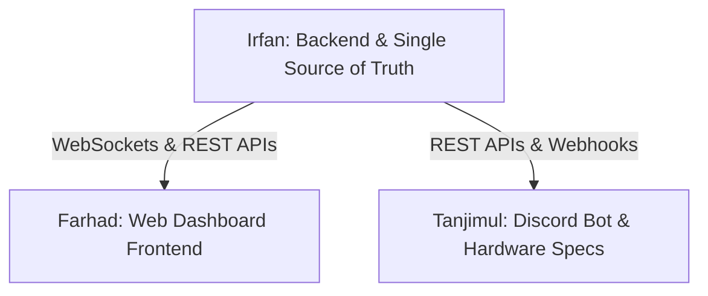

# Hackathon Team Collaboration & Work Distribution Guide

To win this hackathon, we need to minimize blocking dependencies and ensure everyone works on clear, decoupled modules that integrate seamlessly. Below is the split of responsibilities, task lists, and communication contracts.

---

## 👥 Role Assignments



* **Irfan (Backend Lead)**: Focuses on data structures, socket server broadcasts, state mutation controllers, and simulator logic.
* **Farhad (Frontend Designer)**: Focuses on the real-time React UI dashboard, custom SVG/CSS grid layouts, and active interactive state displays.
* **Tanjimul (Integration & Systems)**: Focuses on the Discord bot interfaces, command parsing, proactive alert webhook dispatches, and the hardware schematic.

---

## 🛠️ Individual Task Breakdowns

### 1. Irfan - Backend & Simulator (`dev-irfan` branch)
* **API Implementation**:
  - Refine endpoints in [index.js](file:///Applications/XAMPP/xamppfiles/htdocs/teckathon/backend/src/index.js) for `GET /api/devices` and `GET /api/usage`.
  - Secure state overrides via `POST /api/devices/:id/toggle`.
* **State & Accumulation Math**:
  - Implement active accumulator math in [store.js](file:///Applications/XAMPP/xamppfiles/htdocs/teckathon/backend/src/store.js) to compute estimated daily kWh usage based on active device times.
* **Real-time Engine**:
  - Hook up the `setInterval` loop in [simulator.js](file:///Applications/XAMPP/xamppfiles/htdocs/teckathon/backend/src/simulator.js) to randomly toggle devices and broadcast changes to Socket.io.
  - Implement the **alert logic engine**:
    - Check if devices are ON during after-hours (17:00 to 09:00).
    - Check if a room has had all devices ON simultaneously.
* **Dummy Data Compliance**:
  - Ensure the strict dummy contact list (`Nafisa Rahman` and `Tanvir Hossain`) is used in the alerts dispatch payload.

### 2. Farhad - Web Dashboard Frontend (`dev-farhad` branch)
* **Real-Time Integration**:
  - Connect client sockets to the backend in [App.jsx](file:///Applications/XAMPP/xamppfiles/htdocs/teckathon/frontend/src/App.jsx) and map inbound events (`init_state`, `device_update`, `alert_added`) to local state hooks.
* **Visual Office Layout (Floor Plan)**:
  - Design a premium 3-room responsive grid/box floor plan matching the drawing in the PDF.
  - Render fans as rotating icons when ON (using Tailwind's `animate-spin-slow` class).
  - Render lights as glowing yellow SVGs when ON (using shadow glow and status pulses).
* **Control UI**:
  - Render individual device cards with manual toggle button triggers.
  - Create visual gauges/meters for total power and per-room breakdowns (e.g. customized SVG arc charts or simple CSS progress bars).
* **Alert System UI**:
  - Build a scrolling log panel displaying active system alerts with timestamps and severity colors.

### 3. Tanjimul - Discord Bot & Hardware Schematic (`dev-tanjimul` branch)
* **Discord.js Client**:
  - Configure `bot/.env` with your team's Discord Bot token and Server Admin channel ID.
  - Implement message triggers in [index.js](file:///Applications/XAMPP/xamppfiles/htdocs/teckathon/bot/src/index.js) for:
    - `!status`: Returns a conversational summary of rooms (e.g., *"Drawing Room has 1 fan and 2 lights ON"*).
    - `!room <name>`: Lists detailed device status for a single room.
    - `!usage`: Shows total Watts and estimated daily kWh.
* **Proactive Warning Logs**:
  - Setup a socket connection in the bot to listen to backend `"alert_added"` events, instantly pushing alert cards (with embeds) to the Discord server channel.
* **Circuit Schematic**:
  - Review [circuit_schematic.md](file:///Applications/XAMPP/xamppfiles/htdocs/teckathon/docs/circuit_schematic.md) and implement the actual mock simulation circuit in **Wokwi** using an ESP32 microcontroller, 5-channel relays, and corresponding blue/yellow LEDs. Copy the final Wokwi project URL into the documentation!

---

## 🔌 Integration Contracts (How to Communicate)

To prevent code conflicts, agree on these data standards:

### 1. REST Device Object Structure
```json
{
  "id": "drawing_fan_1",
  "name": "Fan 1",
  "type": "fan",
  "room": "Drawing Room",
  "status": false,
  "powerDraw": 60,
  "lastChanged": "2026-07-03T13:00:00.000Z"
}
```

### 2. WebSocket Broadcast Events
- **Event `device_update`** (sent by Irfan's backend when a device is toggled):
  ```json
  {
    "device": { ...deviceObject },
    "totalPower": 120,
    "roomBreakdown": { "Drawing Room": 60, "Work Room 1": 60, "Work Room 2": 0 },
    "estimatedKWh": 4.285
  }
  ```
- **Event `alert_added`** (sent by Irfan's backend when after-hours/high-load alerts trigger):
  ```json
  {
    "id": "alert_1720000000000",
    "timestamp": "2026-07-03T19:00:00.000Z",
    "message": "[After Hours Alert] Work Room 1 - Light 1 turned ON. Dispatched to Nafisa Rahman.",
    "severity": "warning"
  }
  ```

---

## ⚠️ Development Guardrails & Limitations

To guarantee application stability and prevent team members from deviating from the hackathon specs or blocking each other, everyone must strictly adhere to the following rules:

### 1. Scope and Folder Limitations
* 🚫 **Stay In Your Lane**:
  - **Irfan** works *only* inside `/backend`.
  - **Farhad** works *only* inside `/frontend`.
  - **Tanjimul** works *only* inside `/bot` and `/docs`.
* 🚫 **Do Not Edit Root Configurations**:
  - Do not edit the root `package.json`, root `package-lock.json`, or `.gitignore` without a quick team check-in first. This avoids workspace bootstrap breaks.

### 2. API & Event Contract Freeze
* 🔒 **Shared API Endpoint Rules**:
  - No one may change the structure of the `device` object or API responses in `/backend/src/store.js` without a joint meeting. The structure must remain as specified under the *Integration Contracts* section.
* 🔒 **WebSocket Event Names**:
  - The Socket.io channel event names are locked to `"device_update"` and `"alert_added"`. Changing these will instantly break Farhad's dashboard and Tanjimul's bot notifications.

### 3. Dependency Restrictions
* 🚫 **No Over-Engineering**:
  - **Frontend**: Use standard HTML/CSS and custom SVGs for the floor plan. Do not install massive 3D packages (e.g., `three.js`) or third-party layouts. Keep the bundle size lightweight and compile speed fast.
  - **Backend**: Keep the dataset in-memory (`store.js`). Do not install databases (like PostgreSQL, MySQL) unless SQLite is mutually agreed upon later for persistence.

### 4. Git Etiquette
* 🔒 **Main Branch Protection**:
  - **Never push directly to `main`**.
  - All commits must go to your own development branch (`dev-irfan`, `dev-farhad`, `dev-tanjimul`).
* 🔒 **Merge Verification Rule**:
  - Only merge your code into `main` after:
    1. Confirming the Express server boots cleanly in development.
    2. Confirming that `npm run build` succeeds in the React frontend workspace with zero errors.

---

## 🏆 Hackathon Win Strategy
1. **Complete Features First**: Focus on delivering 100% of the minimum requirements (working socket live dashboard, working bot commands, working alerts, correct schematics).
2. **Wow factor (Aesthetics)**: Farhad should use gradient background borders, backdrop-filters, custom micro-animations (smooth fan spins, pulse dots), and styled alerts to make the UI look like a premium commercial SaaS application.
3. **Conversational Bot**: Tanjimul can hook up a free Gemini API key to feed raw device status data into a prompt, letting the bot formulate extremely friendly, humanized responses to the boss.
